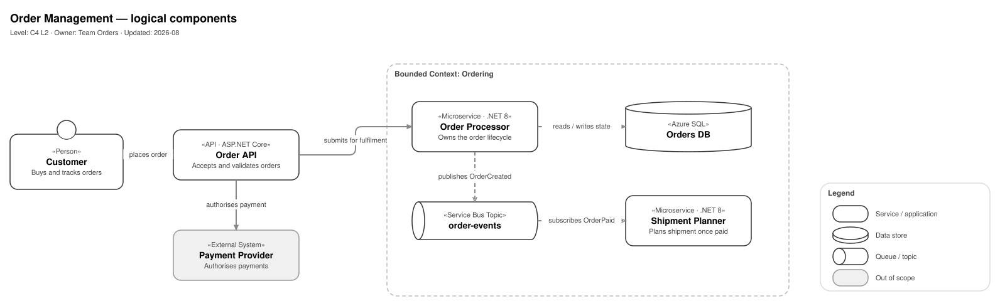

# Architecture diagrams

One way of drawing component and topology diagrams, based on draw.io and on `*.drawio.svg` files kept in the repository next to the code.

## What it gives you

**The diagram lives in git together with the code.** An architecture change and a diagram change travel in the same merge request and go through the same review. There is no separate place you have to remember to update.

**One file is both the image and the source.** `*.drawio.svg` renders in markdown, GitLab and MkDocs with no build step, and opens in the editor on click. No exporting, no pairs of "the diagram and its PNG".

**Editing in VS Code, offline.** The Draw.io Integration extension has the editor built in, so diagram content does not leave the workstation.

**Copilot reads them and can work with them.** The diagram source is text embedded in the file, so the assistant sees component names, descriptions and arrow labels. Because the diagram sits next to the code, you can ask whether one still matches the other.

**Ready-made elements instead of designing from scratch.** The palette contains everything you need. Drawing comes down to copying and labelling.

## Getting started

1. Install the VS Code extension **Draw.io Integration** (`hediet.vscode-drawio`).
2. Copy [`templates/blank.drawio.svg`](templates/blank.drawio.svg) to `docs/diagrams/<area>-components.drawio.svg`. The diagram settings are already saved in it, only the header needs filling in.
3. Open [`templates/palette.drawio.svg`](templates/palette.drawio.svg) alongside and drag elements out of it. `Ctrl+C` and `Ctrl+V` work between draw.io tabs.

That is enough for a first diagram. The remaining rules, with the reasoning behind them, are in the [specification](docs/diagrams.md).

## What it looks like

Further examples and the full description of the notation: [`docs/diagrams.md`](docs/diagrams.md).

## Element palette

## Repository contents

| Path | Role |
|---|---|
| [`docs/diagrams.md`](docs/diagrams.md) | Specification: file format, C4 levels, rules, layout, checklist |
| [`templates/blank.drawio.svg`](templates/blank.drawio.svg) | Empty diagram with the settings in place |
| [`templates/palette.drawio.svg`](templates/palette.drawio.svg) | Element palette |
| [`examples/`](examples/) | Complete component and topology diagrams |
| [`tools/gen.py`](tools/gen.py) | Generator for the palette, the template and the examples |
