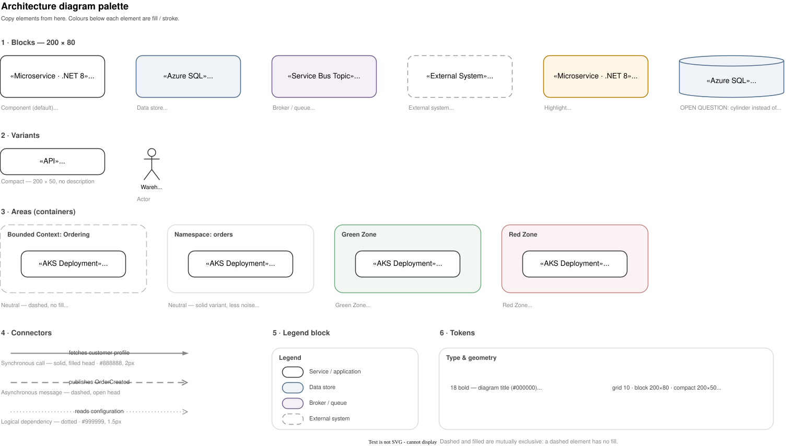

# Diagramy architektoniczne — zasady

**Wersja:** 0.4 · **Status:** propozycja do konsultacji

Jeden system wizualny dla diagramów komponentów i topologii, tak żeby diagram narysowany przez dowolną osobę w zespole wyglądał jak diagram narysowany przez każdą inną. System jest celowo mały — jeśli reguła nie zarabia na siebie czytelnością, nie ma jej tutaj.

---

## 1. Kiedy draw.io, a kiedy Mermaid

| Diagram | Narzędzie | Dlaczego |
|---|---|---|
| Sekwencja, flowchart, state machine, ERD | **Mermaid** | Auto-layout jest tu optymalny, ręczne układanie nic nie wnosi. Zero kosztu utrzymania — kod w markdownie. |
| Komponenty i ich zależności | **draw.io** | Powyżej ~8 węzłów auto-layout Mermaida produkuje plątaninę. Znaczenie niesie układ przestrzenny: warstwy, grupowanie, kierunek przepływu. |
| Topologia / deployment | **draw.io** | Zagnieżdżenie (subskrypcja → klaster → namespace → pod) i granice stref to informacja przestrzenna. |

**Reguła kciuka:** jeśli po wygenerowaniu diagramu w Mermaid chcesz przesunąć choć jeden bloczek — to jest diagram dla draw.io.

---

## 2. Format pliku

Diagramy zapisujemy jako **`*.drawio.svg`**. Taki plik jest hybrydą: dla wszystkiego poza wtyczką draw.io to zwykły obrazek SVG (renderuje się w markdownie, GitLabie, MkDocs — bez build-stepu), a po otwarciu we wtyczce draw.io w VS Code — edytowalny diagram. Źródło siedzi w atrybucie `content` elementu `<svg>`.

SVG, a nie PNG: 20–60 kB zamiast 0.5–5 MB, wektor zawsze ostry, tekst wyszukiwalny, w gicie tekst zamiast binarnego bloba. PNG ma jedną przewagę — wizualny diff w merge requeście — i nie jest ona warta 50-krotnego narzutu na repo.

```
docs/diagrams/<obszar>-components.drawio.svg
docs/diagrams/<obszar>-topology.drawio.svg
```

Nazwy po angielsku, kebab-case, bez wersji i dat (od tego jest git). Jeden diagram = jeden plik. Osadzanie w dokumentacji z obowiązkowym tekstem alternatywnym:

```markdown

```

**Ustawienia diagramu** (w plikach z `templates/` i `examples/` są już ustawione — nowy diagram zaczynaj od kopii):

- **Adaptive Colors: Automatic** (`adaptiveColors="auto"`) — draw.io sam przelicza paletę na tryb ciemny, zachowując odcień. Dlatego **nie ustawiamy tła strony** na białe: wymuszenie tła psuje adaptację.
- **Page View: wyłączony** (`page="0"`) — diagram architektoniczny nie jest kartką A4.
- **Czcionka: Helvetica** — SVG nie osadza fontów, font spoza web-safe rozjedzie się na innej maszynie.
- Cień wyłączony, siatka 10 px.

---

## 3. Poziomy abstrakcji — lekki C4

Pożyczamy słownictwo i poziomy z modelu C4, bez jego notacji graficznej i narzędzi. C4 rozwiązuje najtrudniejszy problem diagramów — *na jakim poziomie szczegółowości jesteśmy* — i nie ma sensu wymyślać tego od nowa.

| Poziom C4 | U nas | Kiedy | Sufiks pliku |
|---|---|---|---|
| L1 System Context | Kontekst | opcjonalnie | `-context` |
| **L2 Container** | **Komponenty logiczne** | **domyślnie** | `-components` |
| L3 Component | Wnętrze komponentu | tylko dla nietrywialnych serwisów | `-components-<serwis>` |
| Deployment | **Topologia** | gdy rozmieszczenie fizyczne ma znaczenie | `-topology` |

Świadome odstępstwo: C4 rysuje wypełnione, nasycone niebieskie prostokąty z białym tekstem — my rysujemy **białe bloczki z ciemną obwódką**. Lepszy kontrast tekstu, czytelność w skali, i kolor zostaje wolny na semantykę (strefy, wyróżnienia).

---

## 4. System wizualny

Cała paleta — kolory, rozmiary, typografia — jest w jednym pliku. Kody hex są podpisane pod każdym elementem, więc nie ma osobnej tabeli do rozjechania się.



### Trzy niezależne kanały

Każdy kanał niesie inny wymiar. Dzięki temu nic nie jest zakodowane dwa razy i nie trzeba pilnować, „która oś jest dziś na kolorze".

| Kanał | Co koduje | Wartości |
|---|---|---|
| **Kształt** | zgrubna kategoria | prostokąt (usługa, aplikacja, komponent, job) · stojący walec (magazyn danych) · leżący walec / pipe (kolejka, topic) · person (rola ludzka) |
| **Kolor** | zakres | biały = w zakresie · szary `#F0F0F0` = poza naszą kontrolą · piaskowy `#FFF6E5` = temat diagramu |
| **Tekst** | dokładny typ i technologia | `«Microservice · .NET 8»`, `«AKS Deployment · 3 repliki»` |

Kolor na osi zakresu to konwencja z przykładów C4 (tam szary = system, który już istnieje albo jest cudzy). Sam model C4 kolorów nie narzuca — wymaga tylko, żeby kodowanie było spójne i opisane w legendzie.

### Siedem reguł

1. **Trzy strefy tekstu w bloczku.** Na górze stereotyp w guillemetach — czym rzecz *jest fizycznie*. W środku nazwa logiczna — jak zespół nazywa to w rozmowie, nie nazwa repo ani zasobu w Azure. Na dole opis odpowiedzialności, maks. ~60 znaków. Jeśli opis się nie mieści, komponent ma prawdopodobnie zbyt szeroką odpowiedzialność — to wartościowy sygnał z samego rysowania.
2. **Walec i pipe niosą tylko stereotyp i nazwę.** Kopuła zjada linię opisu; jeśli opis jest niezbędny, użyj prostokąta.
3. **Jeden wyróżniony element na diagram.** Piaskowe wypełnienie oznacza temat diagramu albo element zmieniany w danym merge requeście. Dwa wyróżnienia to brak wyróżnienia.
4. **Kreska i wypełnienie się wykluczają** — dotyczy obszarów. Obszar kreskowany nie ma wypełnienia, obszar wypełniony ma linię ciągłą. Obie cechy komunikują to samo, więc łączenie ich to podwójne krzyczenie. Kreska oznacza granicę umowną (bounded context, zakres diagramu), linia ciągła — granicę twardą (namespace, klaster). Przy trzech poziomach zagnieżdżenia zawsze linia ciągła, bo nałożone kreski robią mory.
5. **Kierunek strzałki = kto inicjuje**, nie dokąd płyną dane. Strzałka od API do bazy znaczy „API odpytuje bazę", nawet jeśli dane wracają w drugą stronę. Strzałki dwukierunkowe są zabronione — zawsze oznaczają, że autor nie przemyślał, kto inicjuje.
6. **Każda strzałka ma etykietę: czasownik + obiekt.** `publikuje OrderCreated`, `zapisuje stan zamówienia`. Nie `HTTP`, nie `dane`, nie pustka. Protokół w nawiasie tylko wtedy, gdy naprawdę coś wnosi.
7. **Bloczki tej samej kategorii mają identyczną szerokość.** Nierówne szerokości są najsilniejszym sygnałem, że diagram robiono w pośpiechu.

Legenda jest obowiązkowa zawsze i zawiera wyłącznie to, co faktycznie na diagramie występuje. Skoro kształt niesie znaczenie, czytelnik musi mieć gdzie sprawdzić, co znaczy walec — C4 stawia ten wymóg wprost.

Kształt `person` pochodzi z biblioteki C4 wbudowanej w draw.io. Włącz ją raz: **More Shapes → Software → C4**. Pozostałe kształty są w rdzeniu draw.io.

---

## 5. Układ

Layout w draw.io jest ręczny — to jest cała przewaga tego narzędzia nad Mermaidem. Warto ją wykorzystać świadomie.

- **Jeden kierunek przepływu na diagram**: z lewej do prawej albo z góry na dół, nigdy oba.
- **Warstwy jako kolumny**: klienci → brama/API → logika domenowa → dane. Elementy tej samej warstwy w jednej linii.
- **Zależność = bliskość.** Jeśli strzałka przecina cały diagram, przemyśl układ, zanim ją narysujesz.
- **Limit ~15 elementów i 3 poziomy zagnieżdżenia.** Powyżej diagram przestaje być czytelny niezależnie od jakości układu — rozbij na diagram nadrzędny i poddiagramy.
- **Strzałki pod kątem prostym**, bez skosów. Przy nieuniknionych przecięciach mostki (`jumpStyle=arc`).
- **Punkty zaczepienia stałe** — podpinaj strzałki do konkretnych krawędzi, nie do środka bloczka, inaczej przy przesunięciu elementu diagram się rozjeżdża.
- **Wyrównaj i rozłóż równomiernie przed commitem** (panel Arrange). Dwadzieścia sekund pracy, największy pojedynczy zysk estetyczny.

### Co gdzie

**Komponenty logiczne** odpowiadają na pytanie *z czego składa się system i kto z kim rozmawia*. Zawierają komponenty wdrażalne, magazyny danych, brokery, systemy zewnętrzne, aktorów. **Nie zawierają** infrastruktury: nodów, klastrów, sieci, regionów, subskrypcji, liczby instancji.

**Topologia** odpowiada na pytanie *gdzie to fizycznie działa i co przez co przechodzi*. Zawiera granice hostingu, strefy bezpieczeństwa, punkty przejścia i komponenty umieszczone wewnątrz tych granic. Rysujemy na niej **wyłącznie przejścia przez granice** — zależności zamknięte wewnątrz jednej strefy tylko zaśmiecają obraz. Stereotypy opisują tu formę wdrożenia, nie technologię: `«AKS Deployment · 3 repliki»`, `«App Service · P2v3»`.

---

## 6. Checklista przed commitem

- [ ] `adaptiveColors="auto"`, `page="0"`, brak wymuszonego tła — obejrzyj diagram w jasnym i ciemnym motywie
- [ ] Czcionka Helvetica, rozmiary tylko 11 / 12 / 14 / 18
- [ ] Bloczki tej samej kategorii mają tę samą szerokość, wszystko wyrównane do siatki 10 px
- [ ] Żaden element nie jest jednocześnie kreskowany i wypełniony
- [ ] Każda strzałka ma etykietę „czasownik + obiekt"; brak strzałek dwukierunkowych
- [ ] Kolor koduje wyłącznie zakres, kształt wyłącznie kategorię; legenda obecna
- [ ] ≤ 15 elementów, ≤ 3 poziomy zagnieżdżenia
- [ ] Tytuł, poziom C4, właściciel i miesiąc aktualizacji w lewym górnym rogu
- [ ] Osadzony w markdownie z sensownym tekstem alternatywnym
- [ ] `.drawio.svg`, < 200 kB

---

## 7. Antywzorce

| Antywzorzec | Zamiast tego |
|---|---|
| Diagram „wszystko naraz" | Kilka diagramów, każdy odpowiada na jedno pytanie |
| Strzałki bez etykiet | Czasownik + obiekt na każdej |
| Kolor „bo ładnie" | Monochrom, kolor tylko semantycznie |
| Mieszanie poziomów abstrakcji (klasa obok subskrypcji) | Jeden poziom C4 na diagram |
| Nazwy zasobów zamiast logicznych (`app-ord-proc-weu-prod-01`) | Nazwa logiczna w środku, nazwa zasobu w opisie |
| Diagram jako obrazek bez źródła | Zawsze `.drawio.svg` |

---

## 8. Świadome odstępstwa od C4

**Białe bloczki zamiast niebieskich.** C4 rysuje wypełnione, nasycone prostokąty z białym tekstem. Lepszy kontrast tekstu, czytelność w skali i w druku, a przede wszystkim: kolor zostaje wolny na kodowanie zakresu.

**Stereotyp nad nazwą, w guillemetach.** C4 stawia typ *pod* nazwą, w nawiasach kwadratowych: `[Container: .NET 8]`. My zostajemy przy `«Microservice · .NET 8»` nad nazwą. Argument za wersją C4 jest mocny — nazwa jest najważniejsza, a czyta się od góry. Argument za naszą: nazwa jest optycznie wyśrodkowana między dwiema mniejszymi liniami, blok jest symetryczny, a zespół już tak czyta te diagramy. Świadomie zostawiamy jak jest; gdyby to miało się zmienić, jest to zmiana jednej funkcji w generatorze.

**Ikony Azure na topologii.** C4 nic o nich nie mówi. U nas — dopuszczalne jako dekoracja maks. 32 px w rogu bloczka, nigdy zamiast bloczka. Albo wszystkie elementy danego typu mają ikonę, albo żaden.

---

## 9. Materiały

| Plik | Rola |
|---|---|
| [`templates/palette.drawio.svg`](../templates/palette.drawio.svg) | Paleta — otwórz obok i kopiuj z niej elementy |
| [`examples/components-example.drawio.svg`](../examples/components-example.drawio.svg) | Kompletny diagram komponentów |
| [`examples/topology-example.drawio.svg`](../examples/topology-example.drawio.svg) | Kompletny diagram topologii |
| [`tools/gen.py`](../tools/gen.py) | Generator powyższych — jedno źródło prawdy dla stylów |

Wtyczka: **Draw.io Integration** (`hediet.vscode-drawio`).
