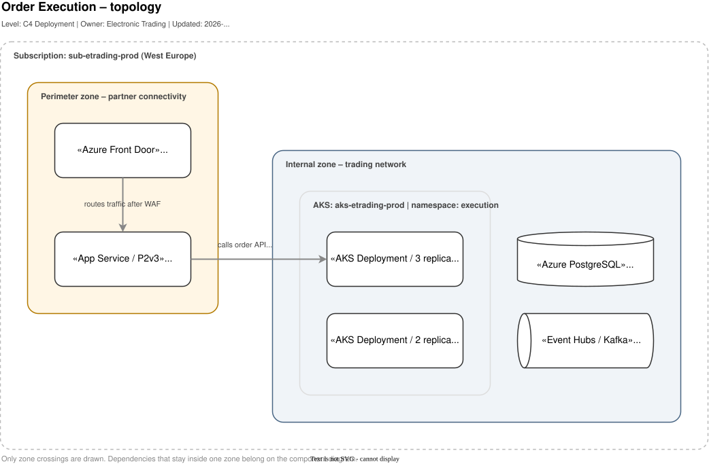

# Architecture diagrams in draw.io

|  |  |
| --- | --- |
| **Author** | Wojciech Ruchlewicz |
| **Status** | Draft |
| **Last updated** | 2026-08-15 |

**Problem:**
Architecture diagrams have so far been drawn in as many styles as there were authors. Each one stayed readable to the person who drew it and expensive to read for everyone else. Review discussions regularly drifted onto notation instead of architecture.

This document establishes a single convention for component and topology diagrams: file format, level of abstraction, the set of elements and the rules for using them. The scope is deliberately narrow. A rule that does not pay for itself in readability is not included here.

**Deviations:**
The rules below cover the typical cases, not all of them. If one does not fit a particular diagram, deviate from it deliberately and record the reason in the merge request description. A single deviation is acceptable. A recurring deviation of the same kind indicates a gap in this specification and should result in a merge request against this file.

---

## draw.io versus Mermaid

draw.io and Mermaid do not compete. Their use cases are disjoint.

| Diagram type | Tool | Rationale |
|---|---|---|
| Sequence, flowchart, state machine, ERD | **Mermaid** | Auto-layout is optimal in these cases and manual arrangement adds no information. Source lives in markdown, maintenance cost is zero. |
| Components and their dependencies | **draw.io** | Above eight to ten nodes Mermaid's auto-layout stops being readable. Meaning here is carried by spatial arrangement: layers, grouping, direction of flow. |
| Topology and deployment | **draw.io** | Nesting (subscription, cluster, namespace, workload) and zone boundaries are spatial information. |

The deciding test: if after generating a diagram in Mermaid you find yourself wanting to move even one box, the diagram belongs in draw.io.

---

## File format

Diagrams are stored as **`*.drawio.svg`**. A file in this format is a hybrid. To every tool other than the draw.io extension it is an ordinary SVG image, rendered in markdown, GitLab and MkDocs with no additional build step. Opened in the extension, it is an editable diagram. The source is held in the `content` attribute of the `<svg>` element.

SVG rather than PNG for four reasons: file size in the range of 20 to 60 kB instead of megabytes, a vector that stays sharp at any scale, text that is searchable and accessible, and a textual rather than binary blob in git. PNG has one advantage, a visual diff in the merge request, and it does not offset the fiftyfold overhead on repository size.

The format is also legible to coding assistants. The source is text embedded in the file, so GitHub Copilot reads element names, labels and the containment hierarchy without any export step, and can generate diagrams in the same notation.

**Naming and location:**

```
docs/diagrams/<area>-components.drawio.svg
docs/diagrams/<area>-topology.drawio.svg
```

Names in English, kebab-case, without version numbers or dates. Versioning is git's job. One diagram corresponds to one file. Embedding in documentation requires alternative text:

```markdown

```

**Diagram settings:**

A new diagram should be created as a copy of [`templates/blank.drawio.svg`](../templates/blank.drawio.svg). The template already carries the settings below.

| Setting | Value | Rationale |
|---|---|---|
| Adaptive Colors | Automatic | draw.io recalculates the palette for dark mode, preserving hue and adjusting lightness. |
| Page background | not set | Forcing a white background disables adaptation and leaves a light rectangle on a dark page. |
| Page View | off | An architecture diagram is not formatted to an A4 page. |
| Font | Helvetica | SVG does not embed fonts, so a typeface outside the web-safe list renders differently on different machines. |
| Shadow, Math | off | Visual noise, increases file size, breaks some labels. |
| Grid | 10 px | Alignment without additional effort. |

---

## Editing diagrams

Diagrams are edited in VS Code using the **Draw.io Integration** extension (`hediet.vscode-drawio`). The extension is unofficial but endorsed by the diagrams.net team, and it bundles a complete offline build of the draw.io editor.

**Offline mode is the default.** The extension uses the bundled copy of the editor, so diagram content does not leave the workstation. This behaviour is controlled by the `hediet.vscode-drawio.offline` setting, `true` by default, and it should not be changed.

**Supported extensions:** `.drawio`, `.dio`, `.drawio.svg` and `.drawio.png`. A new diagram is created by making an empty file with the correct extension and opening it; conversion between formats is done with the `Draw.io: Convert To...` command from the command palette.

**Viewing the source.** The same file can be opened in parallel as XML with the `View: Reopen Editor With...` command. Both views stay synchronised, which allows VS Code find and replace to be used for bulk renaming or style changes. For `.drawio.svg` files the text view shows the SVG with the embedded source in the `content` attribute.

**Code review in GitLab:** during code review GitLab displays SVG files as text. Their presentation can be switched by enabling the preview option.

The extension also supports Live Share, which allows a diagram to be reviewed and discussed jointly without exporting it to a separate file.

---

## Levels of abstraction

From the C4 model we take the vocabulary and the levels, without its graphical notation or tooling. C4 solves the hardest problem in architecture diagramming, namely stating unambiguously which level of detail a diagram sits at.

| C4 level | Our name | When | File suffix |
|---|---|---|---|
| L1 System Context | Context | optionally, when the system's surroundings are not obvious | `-context` |
| **L2 Container** | **Logical components** | by default, the level drawn most often | `-components` |
| L3 Component | Component internals | only for non-trivial services | `-components-<service>` |
| Deployment | **Topology** | when physical placement matters | `-topology` |

**Logical components** answer the question of what the system is made of and which elements communicate with one another. They contain deployable components, data stores, brokers, external systems and actors. They do not contain infrastructure: nodes, clusters, networks, regions, subscriptions or instance counts.

**Topology** answers the question of where the system physically runs and which boundaries traffic crosses. It contains hosting boundaries, network zones, transit points and the components placed inside those boundaries. Only boundary crossings are drawn; dependencies contained within a single zone belong on the component diagram. Stereotypes here describe the form of deployment rather than the technology: `«AKS Deployment / 3 replicas»`, `«App Service / P2v3»`.

---

## Visual system

The complete palette lives in a single file, with hex codes labelled under every element. We do not maintain a parallel table of tokens, so that there is only one source of truth.


The notation rests on three independent channels. Each encodes a different dimension, so no piece of information is conveyed twice.

| Channel | Encodes | Values |
| --- | --- | --- |
| **Shape** | broad category | rectangle (service, application, component, job), upright cylinder (data store), horizontal cylinder or pipe (queue, topic), person (human role) |
| **Colour** | scope | white `#FFFFFF` in scope, grey `#F0F0F0` outside our control, red `#E60000` border on a `#FDECEC` fill for the subject of the diagram |
| **Text** | exact type and technology | `«Microservice / Spring Boot»`, `«Kafka topic»` |

Mapping colour to scope follows the convention used in the C4 examples, where grey marks an existing or third-party system. The C4 model itself does not prescribe colours; it only requires the encoding to be consistent and documented. That role is served here by the palette.

---

## Mandatory rules

The four rules below determine whether a diagram is correct. Breaking any of them leads the reader to false conclusions about the system.

**The direction of an arrow denotes the initiator of the call**, not the direction of data flow. An arrow from an API to a database means that the API queries the database, regardless of which way the data travels. Bidirectional arrows are not permitted, because they always mean that the question of who initiates has been left unresolved.

**Every arrow carries a verb-plus-object label**, for example `publishes OrderExecuted` or `writes order state`. Labels such as a bare `HTTP` or `data`, as well as no label at all, are not permitted. The protocol goes in brackets only where it adds information. A diagram without labels shows nothing but the topology of connections and says nothing about the behaviour of the system.

**The centre of a box carries the logical name**, that is the one the team uses in conversation, not the repository name or a resource identifier. The resource identifier, where needed, goes into the description.

**One level of abstraction per diagram.** Placing a class next to a cloud subscription is the most common reason a diagram stops communicating anything.

---

## Recommended rules

The following affect visual consistency rather than correctness. A deviation is not grounds for blocking a merge request.

- **Three text zones in a box:** the stereotype in guillemets at the top, the logical name in the middle, the responsibility description at the bottom, up to roughly 60 characters.
- **No more than one highlighted element per diagram.** Two highlights cancel each other out.
- **Boxes of the same category share the same width.**
- **A dashed border and a fill are mutually exclusive**, which applies to areas. A dashed area carries no fill; a filled area has a solid border. A dashed border marks a notional boundary, such as a bounded context or the scope of the diagram; a solid border marks a hard one, such as a namespace or a cluster.

---

## Diagram layout

Manual control over layout is the fundamental advantage of draw.io over Mermaid and is worth using deliberately.

- **One direction of flow per diagram**, either left to right or top to bottom.
- **Layers as columns:** clients, gateway and API, domain logic, data. Elements of the same layer aligned on one line.
- **Dependency expressed as proximity.** An arrow crossing the entire diagram is a sign that the layout needs rethinking.
- **The upper limit is roughly fifteen elements and three levels of nesting.** Beyond that a diagram stops being readable regardless of layout quality and should be split into a parent diagram and sub-diagrams.
- **Arrows routed at right angles**, avoiding diagonal segments. Where crossings are unavoidable, enable line jumps (`jumpStyle=gap`).
- **Alignment and even distribution before commit**, using the Arrange panel.

---

## Examples

A logical component diagram. The actor on the left, the gateway, domain logic inside a bounded context, data on the right, the external system marked by a grey fill:


The same system viewed as a topology. Only crossings of zone boundaries are shown:



---

## Pre-commit checklist

The remaining conditions are satisfied automatically when starting from `blank.drawio.svg`.

- [ ] Every arrow carries a label; none is bidirectional
- [ ] All elements come from the palette, colour encodes scope or highlight
- [ ] Boxes carry logical names, not resource identifiers

---

## Deviations from C4

**White boxes instead of blue ones.** The C4 examples use filled, saturated rectangles with white text. The chosen approach gives higher text contrast, scales better, and above all frees colour for encoding scope.

**Stereotype above the name, in guillemets.** C4 places the type below the name, in square brackets, in the form `[Container: Spring Boot]`. We stayed with the type on top and a large name in the middle between two smaller lines, which keeps the box symmetrical.

**Azure icons on topology diagrams.** C4 says nothing about icons. We allow them as decoration up to 32 px in the corner of a box, never in place of a box. An icon applies to all elements of a given type or to none.

---

## Files in this repository

| File | Role |
|---|---|
| [`templates/blank.drawio.svg`](../templates/blank.drawio.svg) | Empty diagram with the settings in place, the starting point for every new file |
| [`templates/palette.drawio.svg`](../templates/palette.drawio.svg) | The palette, kept open alongside as the source of elements to copy |
| [`examples/components-example.drawio.svg`](../examples/components-example.drawio.svg) | A complete component diagram |
| [`examples/topology-example.drawio.svg`](../examples/topology-example.drawio.svg) | A complete topology diagram |
| [`tools/gen.py`](../tools/gen.py) | Generator for the files above, the single source of truth for styles |
